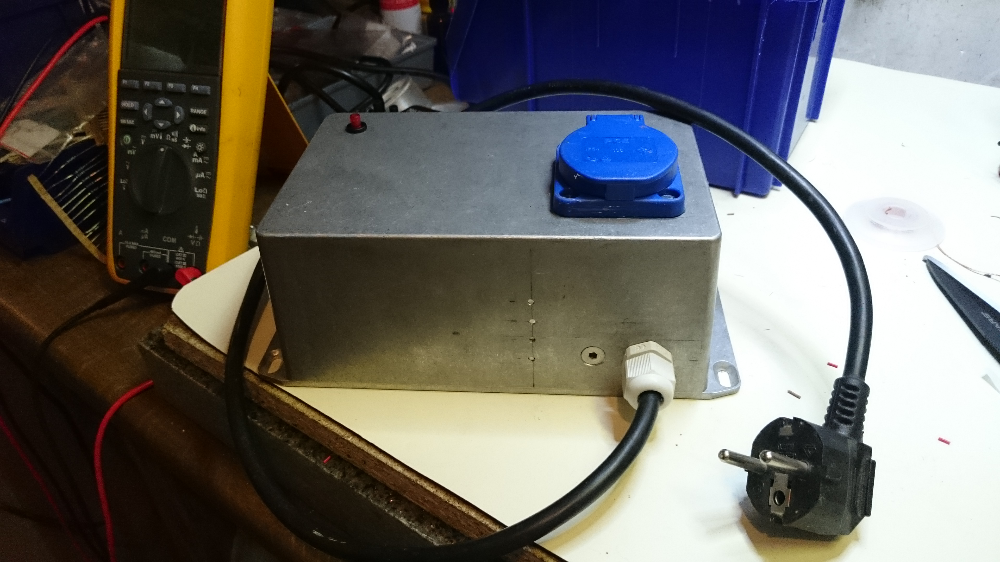
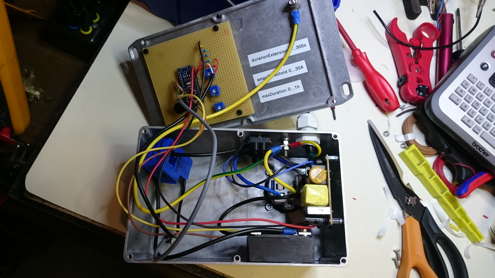
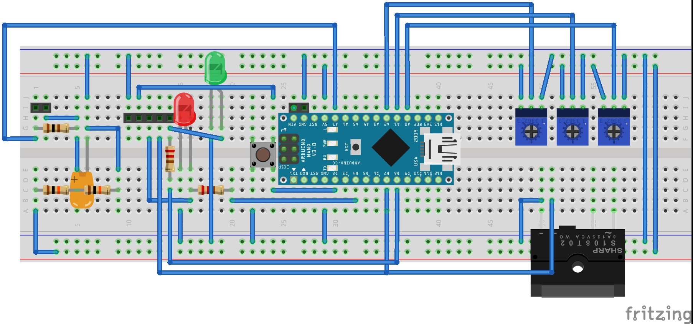
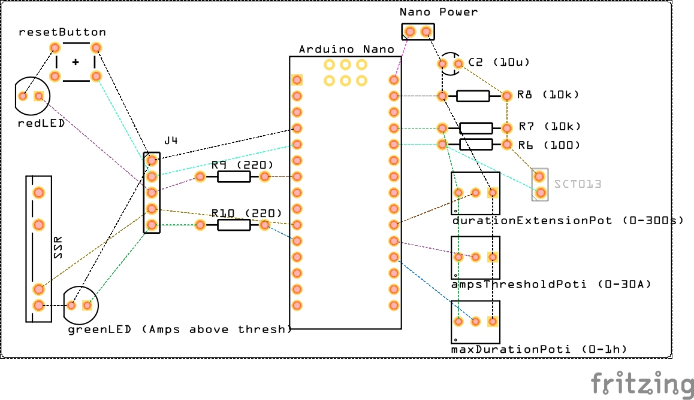

# PowerOnGuard
Arduino based project limiting the duration a device can consume electricity even if the device consumes only periodically like certain water pumps.

## The outside and general functionality

It is simple: A box that provides electricity while its reset button is not blinking. It starts to blink when power has been consumed for too long. To restart the system and provide power again the reset button must be pressed.

The components: Switching Power Supply, Microcontroller, Solid State Relay (SSR), Current Sensor, ...

## Main Components

* Aluminum case: 222 x 146 x 55 mm
* Switching Power Supply: 
  * Input 230V AC
  * Output 7,5 V DC, 2 A
* Microcontroller: Arduino Nano v3
* SSR: RA2425-D06 (use some thermal compounds for good heat dissipation)
* Current Sensor: SCT 013-030 30A / 1V

## Function in more detail
Unlike most commercially available solutions to switch off a device after it consumed energy for too long, this guard works also with devices which have short periods when no power is consumed, but the device is still considered to be consuming power.
Three potentiometers are used to configure the system for a certain device:
* ampsThreshold: 0 ... 10 A

  The minimum amperes that need to drawn such that the algorithm starts to count the time since when this started.
* maxDurationSeconds: 0 ... 3600s (=1h)

  The maximum time in seconds that amps may be drawn. Afterwards the state is toggled and power is switched off.
  The red LED will start to blink. To get power again, the reset switch must be pressed. It will toggle the state.
* durationExtensionSeconds: 0 ... 300s

  Some machines like pumps draw amps for some time and then stop to draw amps, but they are still "on", e.g. pump water.
  This propery is to "virtually" extend the duration where amps are actually drawn to allow the algorithm to account for such machines.

## Circuit

